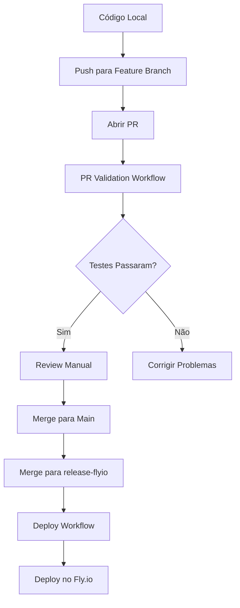

# 🚀 Setup Completo CI/CD - GitHub Actions + Fly.io

## ✅ Arquivos Criados

### 1. Workflows GitHub Actions
```
.github/workflows/
├── deploy.yml           # Pipeline principal (testes + deploy)
├── dependabot.yml       # Auto-merge Dependabot
└── pr-validation.yml    # Validação de Pull Requests
```

### 2. Configurações
```
.github/
├── dependabot.yml       # Configuração Dependabot
└── README_CICD.md       # Documentação completa
```

### 3. Documentação
```
tests/README_TESTES.md   # Documentação dos testes
SETUP_CICD.md           # Este arquivo (resumo)
```

## 🔧 Configuração Necessária

### 1. Secrets do GitHub (OBRIGATÓRIO)
Vá em: **Settings → Secrets and variables → Actions**

```bash
FLY_API_TOKEN=your_fly_api_token_here
```

### 2. Criar Token Fly.io
```bash
# Instalar Fly CLI
curl -L https://fly.io/install.sh | sh

# Login
flyctl auth login

# Obter token
flyctl auth token
```

### 3. Criar Branch de Release (OBRIGATÓRIO)
```bash
git checkout -b release-flyio
git push origin release-flyio
```

## 🎯 Como Funciona

### Fluxo de Desenvolvimento


### Triggers dos Workflows

#### `deploy.yml` (Pipeline Principal)
- **Testes**: Push em qualquer branch + PRs
- **Deploy**: Apenas push na `release-flyio`

#### `pr-validation.yml` 
- **Trigger**: Qualquer PR aberto/atualizado
- **Função**: Validação rápida + comentários automáticos

#### `dependabot.yml`
- **Trigger**: PRs do Dependabot
- **Função**: Auto-merge de updates seguros

## 📋 Checklist de Setup

### Pré-requisitos
- [ ] Repositório no GitHub
- [ ] Conta no Fly.io
- [ ] Fly CLI instalado

### Configuração
- [ ] Adicionar `FLY_API_TOKEN` nos secrets do GitHub
- [ ] Criar branch `release-flyio`
- [ ] Configurar app no Fly.io (`flyctl launch`)
- [ ] Editar `.github/dependabot.yml` com seu username
- [ ] Testar pipeline com um commit

### Verificação
- [ ] Testes locais passam: `uv run pytest tests/ -v`
- [ ] App roda local: `uv run python -m app.main`
- [ ] Deploy manual funciona: `flyctl deploy`

## 🧪 Comandos Úteis

### Testes Locais
```bash
# Todos os testes
uv run pytest tests/ -v

# Testes específicos
uv run pytest tests/test_opportunities.py::TestValidateCpfCnpj -v
uv run pytest tests/test_create_opportunity_examples.py -v -s

# Com cobertura
uv run pytest tests/ --cov=app --cov-report=term-missing
```

### Deploy Manual
```bash
# Verificar status
flyctl status

# Deploy manual
flyctl deploy

# Ver logs
flyctl logs -n 50
```

### Debug CI/CD
```bash
# Simular localmente
act -j test  # Se tiver act instalado

# Verificar sintaxe YAML
yamllint .github/workflows/*.yml
```

## 🚨 Troubleshooting

### Problemas Comuns

1. **Token Fly.io inválido**
   ```bash
   flyctl auth token  # Gerar novo token
   ```

2. **Testes falhando no CI**
   ```bash
   uv run pytest tests/ -v --tb=long  # Ver detalhes
   ```

3. **Dependabot não fazendo auto-merge**
   - Verificar permissões do repositório
   - Verificar se username em `.github/dependabot.yml` existe

4. **Deploy falhando**
   ```bash
   flyctl logs  # Ver logs de erro
   cat fly.toml  # Verificar configuração
   ```

## 🎯 Próximos Passos

1. **Executar Setup**:
   - Configurar secrets
   - Criar branch release-flyio
   - Fazer primeiro commit

2. **Testar Pipeline**:
   ```bash
   git checkout release-flyio
   git commit --allow-empty -m "test: trigger deploy pipeline"
   git push origin release-flyio
   ```

3. **Monitorar**:
   - GitHub Actions tab
   - Fly.io dashboard
   - Dependabot PRs

## 📊 Benefícios Implementados

### ✅ Automação Completa
- Testes automáticos em cada PR
- Deploy automático na branch release
- Updates de dependências automáticos

### ✅ Qualidade de Código
- 25+ testes automatizados
- Validação de sintaxe
- Verificação de segurança
- Comentários automáticos em PRs

### ✅ Segurança
- Auto-merge apenas para updates seguros
- Verificação de secrets hardcoded
- Scan de vulnerabilidades

### ✅ Eficiência
- Deploy em menos de 5 minutos
- Feedback imediato em PRs
- Zero configuração manual após setup

---

🎉 **Pipeline CI/CD Completo e Pronto para Uso!**

Qualquer dúvida, consulte `.github/README_CICD.md` para documentação detalhada.